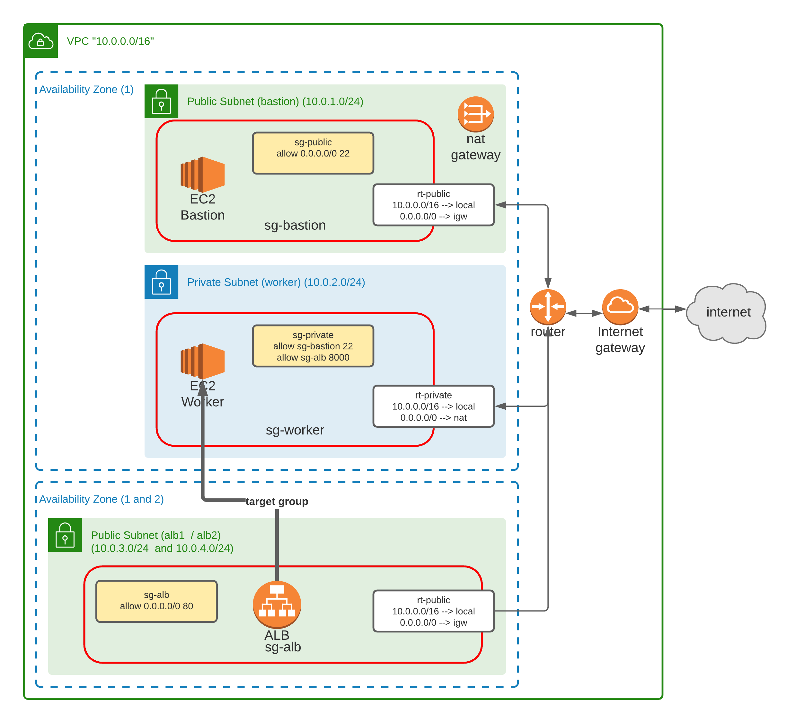

# Deploy the API to a staging env

### Infra schema

### Deploy sequence
#### 1) Deploy the S3 bucket to store frontend
In `{project}/infra/frontend`:
- run `terraform init`    (first time only)
- run `terraform apply -auto-approve` (if you made a change only)

#### 2) Deploy the Infra Networking
In `{project}/infra/networking`:
- run `terraform init`    (first time only)
- run `terraform apply -auto-approve`  (if you made a change only)

#### 3) Deploy the Infra Security Groups
In `{project}/infra/security`:
- run `terraform init`    (first time only)
- run `terraform apply -auto-approve`  (if you made a change only)

#### 4) Deploy the ALB
In `{project}/infra/alb`:
- run `terraform init`    (first time only)
- run `terraform apply -auto-approve`  (if you made a change only)

#### 5) Deploy the BASTION JumpBox
In `{project}/infra/bastion`:
- run `terraform init`    (first time only)
- run `terraform apply -auto-approve`  (if you made a change only)

#### 5) Deploy the Backend Worker JumpBox
In `{project}/infra/worker`:
- run `terraform init`    (first time only)
- run `terraform apply -auto-approve`  (if you made a change only)
  
⚠️ PHP configuration is changed to allow connections from the ALB

#### 6) Deploy the frontend
In `{project}/frontend`:
- run `./deploy.sh`

This sequence changes the `.env.production` to target the ALB as API. Then the frontend is built and deployed inside the S3.

⚠️: deploy.sh as been tested on MacOS only. 

⚠️: deploy.sh must be executable (`chmod +x deploy.sh` may be required)

### DESTROY FULL STACK sequence
In `{project}/infra`:
- ./destroy-all-stack.sh

